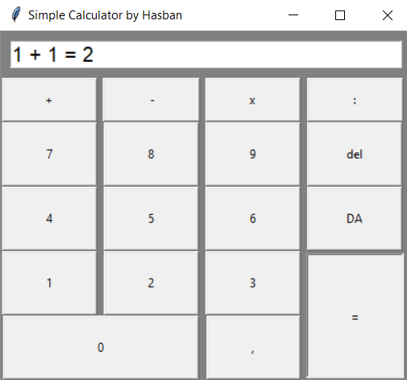

# Tekinter Calculator App



## Deskripsi
Kalkulator ini sama mirip dengan kalkulator bawaan pada perangkat kalian, tapi di kalkulator ini tidak ada e [(bilangan Euler)](https://id.wikipedia.org/wiki/E_(konstanta_matematika)) 


## Getting Started

### Requirements

* python 3.8.5 atau lebih
* tkinter 8.6 (di windows otomatis ada setelah install python)

### Installasi

* Download [python](https://www.python.org/downloads/) lalu install
* Download scriptnya dalam bentuk zip [di sini](https://github.com/Hasban-Fardani/tkinter-calculator/archive/refs/heads/main.zip) atau bisa juga menggunakan [git](https://git-scm.com/) di cmd/terminal: 
```
git clone https://github.com/Hasban-Fardani/tkinter-calculator.git
```

* unzip tkinter-calculator (jika menggunakan git tidak perlu)

### Cara Menjalankan Script

* buka terminal/cmd
* masuk ke folder tempat menyimpan script tadi menggunakan perintah ```cd <namafolder>``` misal:
```
cd D:\Fardan\github\tkinter-calculator
```
* lalu jalankan scriptnya dengan perintah
```
python calculator.py
```

## Help

jika terjadi error
```
ImportError: No module named 'tkinter'
```
dan anda menggunakan linux os, maka jalankan perintah ini:
```
sudo apt install python3-tk
```

## Executable file
klik [di sini](https://github.com/Hasban-Fardani/tkinter-calculator/releases/download/main/calculator.exe) untuk mendownload script dalam bentuk file [exe](https://en.wikipedia.org/wiki/.exe)

## Author

[Hasban Fardani (github)](https://github.com/Hasban-Fardani)  
[Hasban Fardani (Facebook)](https://www.facebook.com/hasban.fardani.92/)

## preferensi

* [download python](https://www.python.org/downloads/)
* [git](https://git-scm.com/)
* [tkinter tutorial](https://www.youtube.com/watch?v=yQSEXcf6s2I&list=PLCC34OHNcOtoC6GglhF3ncJ5rLwQrLGnV) by [john elder](https://github.com/flatplanet) from [codecademy](https://codecademy.com/)
* [tkinter documentation](https://docs.python.org/3/library/tk.html)
* [tkinter tutorial by tkdocs.com](https://tkdocs.com/tutorial/)
* [what is exe file?](https://en.wikipedia.org/wiki/.exe)
